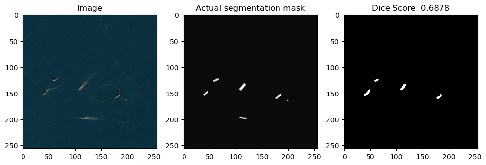

# Semantic segmentation solution for Airbus Challenge Task 
## UNet Model Implementation with dice score target metric

This project is a semantic segmentation solution for the [Airbus Ship Detection Challenge](https://www.kaggle.com/c/airbus-ship-detection/overview). The goal of the challenge is to develop a model that can accurately identify ships in satellite images.

## Purpose
The purpose of this project is to provide an implementation of the [UNet](https://arxiv.org/abs/1505.04597) model for semantic segmentation. By utilizing the UNet architecture, the project aims to accurately segment and identify ships in satellite images provided by the Airbus Ship Detection Challenge.

## Getting Started
To get started with this project on your local computer, follow the steps below:

1. Clone the repository using the command below:
```
git clone https://github.com/muratalkhadam/ship-segmentation.git
```
2. Move into the directory where we have the project files:
```
cd ship-segmentation
```
3. Create a virtual environment:
```
python -m venv venv
```
4. Activate the virtual environment:
```
# for Windows
venv\Scripts\activate
# for Linux/Mac
source venv/bin/activate
```
5. Install the required dependencies from the `requirements.txt`:
```
pip install -r requirements.txt
``` 
6. Install the dataset from the [Airbus Ship Detection Challenge](https://www.kaggle.com/c/airbus-ship-detection/data) and place it in the `data` folder.
## Project Structure
The `ship-segmentation` project is organized into the following folders:
```
├───data: Contains the test and train datasets provided by the Airbus Ship Detection Challenge.
│   ├───test_v2
│   |───train_v2
|   |───sample_submission_v2.csv
|   └───train_ship_segmentations_v2.csv
├───docs: Contains randomly selected images from the testing dataset for documentation purposes.
├───eda: Includes Jupyter Notebook file for exploratory data analysis.
│   └───dataset-analysis.ipynb
└───src: Contains the source code of the project.
    ├───model-data: Includes data related to the model, like saved model architecture, history and metric statistics.
    |───unet: Contains the code specific to the UNet architecture model and related packages.
    └───model-implementation.ipynb: Jupyter Notebook file for the model implementation.
```
## Summary

### `Dice coefficient` was chosen as a metric for evaluating the performance of the model. Since in the tasks of semantic segmentation in most cases the ratio of background and foreground classes is not equal, the `accuracy` metric can incorrectly represent the performance of our model.
### *Dice coefficient* is a metric that is used to compare the similarity of two samples. In our case, the samples are the predicted mask and the actual segmentation mask. The formula for calculating is as follows:
<div style="text-align:center">
  
</div>

## The overall result of the target metric was 67%. 
### I will show the results of testing on random data below:

> #### Recognized 1 ship in the image with `92.62%` dice coefficient.


> #### Recognized 2 ships out of 3 in the image with `48.31%` dice coefficient.


> #### Recognized 4 ships out of 6 in the image with `68.78%` dice coefficient.


### The model demonstrates the ability to detect ships in the image; however, it struggles with accurately delineating the ship boundaries. This limitation arises from training the model on a limited number of epochs and a small dataset. To enhance the model's performance, it is crucial to train it on a more extensive dataset and for a more extended period.
<div style="text-align:center">
  
</div>

### It is important to note that the current results are influenced by the computational limitations and hardware constraints of the training environment.

# Will be thankful for any feedback! :)